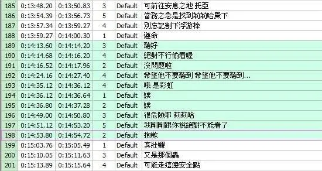

## 前言
本文定位为科普文，大佬如果觉得无聊可以退出了，如有错误或者说的不清楚的地方，烦请各位大佬指正。此为第一部分，后续应该会更新。  
**注，本文/系列由于特殊性，大部分图片不进行压缩处理**
## 看前建议
- 建议看下这篇文章以及该VCB-S博客的其他科普文章，比我这篇写的好多了。[https://vcb-s.com/archives/2726](https://vcb-s.com/archives/2726)

## 质量命名
**本部分不仅针对于番剧，对于所有BT/PT的影视作品命名基本都适用**
- WebDL *Web Download* 的缩写，意为直接从网络流媒体下载的源(后头介绍几个常见的番剧流媒体平台)[[1]](./#番剧主要流媒体平台)
- WebRip *Rip* 此处意为压制[[2]](./#压制是什么)，即从网络流媒体下载后经过压制后发布。
- BDRip *BD* 此处为 Blu-ray Disc 的缩写(注意，这不等于 *DVD* Digital Versatile Disc，BD的储存容量大很多，其他区别请自行搜索)，BDRip即为蓝光光盘的压制
- Remux 直译为重新混合，即将BD(主要是)的视频流，音频流等**无损**提取出来并打包为mkv(主要是)格式，使得大部分播放器能直接播放 ~~(而且没有那么多繁琐的小文件)~~
- CAM 即所谓的枪版，在电影院录制而来，一般质量都不是很好。
- 剩下的基本也就是这些组合了，如TVRip就是对TV源进行压制，DVDRip就是对DVD源进行压制，等等……
## 番剧主要流媒体平台
### Bilibili
- Bilibili 在中国大陆，中国港澳台，东南亚(一般也称B-Global)均有。其中中国大陆因为众所周知的原因有较多删减，中国港澳台少部分会有删减，如图
  
港澳台全片时长为22:17(算上片头10s，东南亚无片头)，东南亚全片时长为22:50，删除部分的字幕为

感兴趣的可以自己找原片看下，并没有露点的镜头，只是有些隐喻罢了。
Bilibili 一般中国港澳台会自带中文繁体字幕，少部分有中文简体，但大部分raw组也会跑一遍繁化姬转为简体，Bilibili东南亚一般在首发不带中文(推子第一集是例外)，但会提供超分4K源，画质还算不错(但你还是不能指望你B的压制，总体还是一般)。
### 湾湾流媒体
- 主要指 Bahamut，KKTV，Friday 这三个中国台湾的流媒体平台，性质差不多就一起讲了。Bahamut 即 Baha(巴哈)，一般删减比较少，**但所有的番都是繁体硬字幕[[3]](./#硬字幕是什么)** KKTV比较神奇，部分和Baha一样为繁体硬字幕，部分有软字幕(貌似是根据番剧代理商决定的？) Friday了解不多，就不多说了。
### Crunchyroll
- 简称CR，为美国番剧流媒体平台，码率给的很稳定的8Mbps（注：奈飞一般给的为6Mbps），但感觉有些虚高，实际质量也一般。关于字幕，一般认为CR不包含中文字幕，但最近听TG大佬们说，CR目前并不会同步中文字幕，而是隔一段时间才上传。（也可能不再更新？）字幕人名应该有校对过，但标点符号乱，也有很多机翻的痕迹。部分番为CR独占。另外，CR新番更新貌似会比B-Global和Baha慢半小时左右。
### iQIYI
- 此处指爱奇艺海外版，简称IQ，爱奇艺的片源我自己没有下载看过，实际体验如何不太好评价，字幕做的还不错，尤其在Bilibili港澳台买的番很少的那段时间，经常都是拿IQ的字幕去看的。
### Abema
- 日本流媒体平台，没有任何的字幕(是的，日本人看番好像都完全不需要字幕的，我自己感觉有些时候看中文电影都还需要中文字幕，不太能理解)
### Netflix
- 即奈飞。虽然Netflix并不以番剧为主，但也在此说下吧。Netflix的压制质量没得说，非常不错，但一般中文字幕质量不高，有一种机翻的感觉。部分番为Netflix赞助，这种基本就位Netflix独占，如《赛博朋克·边缘行者》

## 各平台删减情况
上文已经对比过Bilibili中国港澳台以及Bilibili东南亚的删减情况，此处不再赘述。  
一般来说，Abema的删减是最少的，毕竟是日本本土的流媒体平台，一般只要没露出性器官就不会遮挡/打码，其次是CR，自由美利坚，美国是允许成人色情的，一般的色情内容也不会进行打码。
TODO：等回来附个具体的对比，这次先写到这里了

## 补充
### 压制是什么
**此处以原盘举例，其他片源亦可压制，甚至可以二压**  
首先，要明白为什么要压制：一部剧其原盘大小是非常大的，如芙莉莲的其中一集，其Remux质量的视频文件大小达到了7G+,这么算下来，一部番(12集计算)，便需要接近100G的空间来存储，硬盘存几部番就不够用了，同时如果要在线播放这些原盘，对网络也是一个不小的挑战。同时，原盘也可能存在大量噪点等其他问题，其观感在某些时候甚至可能不如优秀的BDRip。番剧中常见的瑕疵[看这里](https://vcb-s.com/archives/4738)  
而压制，就是一个重编码的过程，一方面，是可以减少体积(当然，也会有比原盘更大的压制，但不多)，另一方面，也可以修复原盘的瑕疵(也有可能出现更多瑕疵bushi)，压制有很深的学问，本人了解甚少，不过多赘述。有想要学习的大佬建议看[VCB-S的教程](https://guides.vcb-s.com/)
### 硬字幕是什么
硬字幕即内嵌于视频中的字幕，也就是说无法将这种字幕与片子本身分离开来。而与之相对的便是软字幕，也就是内封字幕，这种字幕是单独作为一条轨内封于视频中，可以自由的提取或者更换为其他字幕。一般情况下，我更倾向于软字幕，因为可以自由的选择字幕。